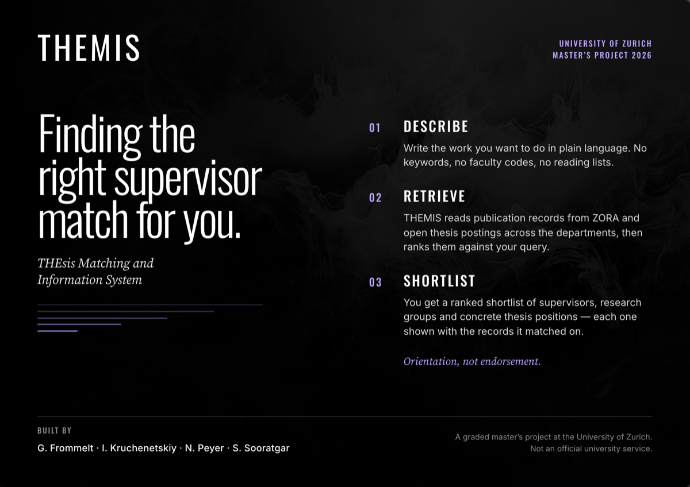
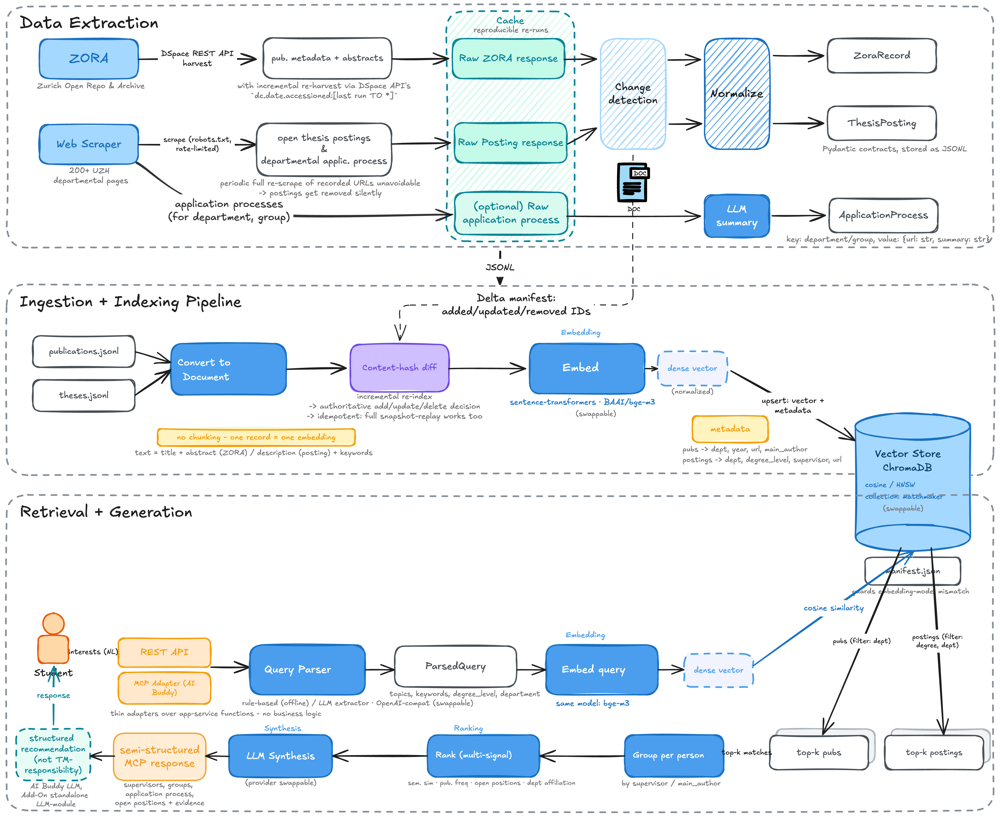

# THEMIS

**THE**sis **M**atching and **I**nformation **S**ystem — finds thesis supervisors and open thesis
positions at the University of Zurich. A student describes their interests in plain language, and
THEMIS searches UZH publications (ZORA) and scraped thesis postings, ranks the researchers behind
them, and answers with the evidence for each suggestion.

This repository is the matchmaking core — ingestion, indexing, retrieval, synthesis, and the MCP
adapter over them, built as a five-member `uv` workspace: `themis-shared`, `themis-matcher`,
`themis-gateway`, `themis-zora`, `themis-scraper`. Start at
[Quickstart](#quickstart). THEMIS is orientation, not endorsement, and a graded master's project
rather than an official University of Zurich service.

## How it fits askUZH

UZH's AI Buddy is becoming [askUZH](https://www.ai-buddy.uzh.ch/en.html), an
assistant for the whole university. This project is built to plug into it as a
tool: we run our own standalone MCP server, askUZH points its agent at that
URL, calls our structured tool, and writes the final answer itself. Nothing
from this repository gets merged into askUZH, and the system also works on its
own through the CLI.




*Target state. The REST API and the multi-signal ranking box are not implemented
yet, and the application-process summaries are scraped and stored but not yet
surfaced — the per-package READMEs linked under [Layout](#layout) say what
actually exists.*

## How it works

1. **Ingestion.** ZORA harvesting and departmental web scraping produce
   publication and thesis-posting records, validated against the shared pydantic
   contracts in `libs/shared/src/themis_shared/contracts`. Harvesting is live and writes
   rows into the `publication` table —
   [`themis-zora-harvest`](docs/zora-harvester.md) — 214,756
   publications as of 2026-08-25, of which 53,545 carry a UZH author. Scraping is live
   too — [`themis-scraper`](projects/scraper/README.md)
   reads 103 curated departmental pages and writes the `posting` table. The
   `data/samples/` fixtures are drawn from both tables now, so the offline path
   runs on real records too.
2. **Indexing.** Records are embedded (BGE-M3, swappable; a deterministic
   `hash-fake` stand-in keeps tests and CI offline) and upserted into a
   Postgres table with a pgvector column, incrementally via a content-hash
   diff. Create the schema first with `themis-init-db`.
3. **Query.** Free text is parsed into topics, degree level, and department,
   by a rule-based parser offline or any OpenAI-compatible LLM when one is
   configured. The query is embedded with the same model, matched against
   publications and postings, grouped per UZH researcher, and ranked.
4. **Answer.** Two tools: one returns the ranked researchers with evidence as
   structured data (what askUZH uses), one writes a grounded recommendation in
   prose. An offline template keeps everything runnable without any LLM, and a
   match that clears no score threshold is answered deterministically rather
   than handed to a model. Both are served by the MCP adapter.

## Quickstart

Needs [uv](https://docs.astral.sh/uv/) and Python 3.11+.

```
uv sync --all-packages            # installs exactly what uv.lock pins, dev tooling included
cp .env.example .env              # optional, everything runs offline by default
docker compose up -d postgres     # Postgres + pgvector on localhost:5432
uv run themis-init-db  # creates the schema
uv run themis-matcher index    # indexes the 50 checked-in samples
uv run themis-matcher match "I want a master's thesis in NLP on RAG"
```

**`--source` decides what you are searching.** It defaults to `SOURCES_PATH`,
which is `data/samples` — right for a fresh clone, but only 50 documents. Once
the harvester has run, the corpus is in the `publication` table and wants
`themis-matcher index --source db`. Nothing warns you about the difference.

**A bare `uv sync` is an error here.** The workspace root is virtual — it has no `[project]`
table — so there is nothing for it to install. Pass `--all-packages`, or `--package themis-<x>`
for one member.

Optional extras belong to the member that owns them:
`--package themis-matcher --extra embeddings` adds the real embedding model (pulls in torch),
`--package themis-gateway --extra mcp` adds the MCP server, and
`--package themis-scraper --extra scraping` is what the scraper needs to run at all
(`--extra render` adds the Playwright fallback for pages that need a browser).
`uv sync --all-packages --all-extras` is the everything option. Note there is one `.venv`, at
the root: unlike `pip install`, `uv sync` makes it *match* what you named, so `--package X`
replaces its contents rather than adding to them. All configuration is documented in
`.env.example`; to use an LLM, point `LLM_BASE_URL` at any OpenAI-compatible
endpoint (LibreChat in production, or a local Ollama during development).

Real example output is in [docs/example-run.md](docs/example-run.md).

Other entry points:

```
themis-gateway-mcp                     # MCP server, HTTP on :8000/mcp
themis-zora-harvest --mode full        # ZORA harvest
themis-scraper fetch --resume          # scrape postings (needs the scraping extra)
themis-matcher repl                    # interactive query loop

# operator scripts, run as files rather than modules
python projects/zora/scripts/zora_inspect_fields.py
python projects/zora/scripts/zora_authority_audit.py
python projects/zora/scripts/backfill_orcid_authorities.py
```

## Layout

One library in `libs/`, four deployables in `projects/`, one distribution each. Every member has
its own README with its public API, data flow, configuration, and known gaps.

| Member | Distribution | What it does |
|---|---|---|
| [`libs/shared/`](libs/shared/README.md) | `themis-shared` | Settings, the connection pool, the schema and `themis-init-db`, and [`contracts/`](libs/shared/src/themis_shared/contracts/README.md) — the Pydantic models every other member speaks. Imports nothing of ours. |
| [`projects/zora/`](projects/zora/README.md) | `themis-zora` | Harvests ZORA via the DSpace REST API. Owns all writes to `publication`, `person`, `org_unit`. |
| [`projects/scraper/`](projects/scraper/README.md) | `themis-scraper` | Scrapes thesis postings, profiles and application procedures from 103 UZH pages. Owns all writes to `posting`. |
| [`projects/matcher/`](projects/matcher/README.md) | `themis-matcher` | The engine — see its five sub-packages below. |
| [`projects/gateway/`](projects/gateway/README.md) | `themis-gateway` | MCP server. A REST API is planned, not built. |

Inside `themis-matcher`:

| Sub-package | What it does |
|---|---|
| [`indexing/`](projects/matcher/src/themis_matcher/indexing/README.md) | JSONL → `Document` → content-hash diff → Postgres/pgvector. No chunking. |
| [`retrieval/`](projects/matcher/src/themis_matcher/retrieval/README.md) | Filtered semantic search, UZH-author pre-filter, grouping per person. |
| [`parsing/`](projects/matcher/src/themis_matcher/parsing/README.md) | Free text → topics, degree level, department. |
| [`synthesis/`](projects/matcher/src/themis_matcher/synthesis/README.md) | Grounded prose answers, with an offline template fallback. |
| [`pipeline/`](projects/matcher/src/themis_matcher/pipeline/README.md) | The application-service functions the gateway calls. |

Plus `cli.py` and `llm.py` (the OpenAI-compatible client) in the matcher. `themis-zora` and
`themis-scraper` each carry their own `config.py`, and the scraper its own `llm.py` — a separate,
`openai`-based module, not the matcher's.

Three things stay at the repository root on purpose: `data/` (the config defaults that reach it are
CWD-relative), `conftest.py` (the `dsn` fixture and the guard that refuses to TRUNCATE a database
whose name does not end in `_test`), and `tests/integration/`, whose four tests assert that what
zora and scraper write into shared's schema is what the matcher reads back — a contract belonging
to no single member. `docker/` holds no Dockerfile; the four live beside the code they build, and
what is left there is local-dev Postgres setup.

One idiom runs through the matcher's `parsing`, `indexing`, `retrieval`, and `synthesis`:
`base.py` defines a `Protocol`, sibling modules implement it, and `__init__.py`
exposes a `build_*(settings)` factory that picks one. Each also ships a real
offline implementation — `HashEmbedder`, `FakeRetriever`, `RuleBasedExtractor`,
`TemplateSynthesizer`, `InMemoryVectorStore` — which is why the whole pipeline runs in CI with no
model download and no network.

## Development

```
uv sync --all-packages --all-extras
uv run ruff check . && uv run ruff format --check .
uv run pytest
```

**Run pytest from the repository root.** `testpaths`, `pythonpath` and the rootdir live only in
the root `pyproject.toml`, so `cd projects/zora && pytest` sees none of them. To run one member's
tests, name the directory instead: `uv run pytest projects/scraper/tests`.

538 tests across 39 files. 66 of them need Postgres and skip when `DATABASE_URL` is unset; point it
at a database whose name ends in `_test` (`docker compose up -d postgres` creates
`matchmaker_test` for exactly this), because the fixtures TRUNCATE between tests and the guard in
`conftest.py` will refuse anything else.

### Before you push

```
scripts/check.sh          # lint, format and tests in the current .venv, ~1 min
scripts/check.sh --ci     # rehearse all five CI jobs in throwaway envs, ~5-10 min
```

The second one is not optional politeness, and the reason is specific: **CI installs less than
your machine has.** `offline` and `pgvector` sync `--all-packages` with *no extras*, while a
development `.venv` accumulates `scraping`, `embeddings` and `mcp`. A green local `pytest` is
therefore evidence about a strictly larger environment than the one CI runs, and the difference
has been red twice — an `mcp` release that removed FastMCP, and a `conftest.py` whose
`pytest.importorskip("bs4")` aborted the entire session wherever the `scraping` extra was absent,
while the one job that installs it stayed green.

`--ci` never touches `.venv`. A uv workspace has a single environment, so `uv sync --package X`
would *replace* it — uninstalling torch and costing a multi-GB re-download — which is why each
rehearsal is redirected into a scratch directory with `UV_PROJECT_ENVIRONMENT`. Pass
`THEMIS_TEST_DATABASE_URL` to include the `pgvector` job; it is deliberately not `DATABASE_URL`,
and it refuses any database whose name does not end in `_test`, because those fixtures TRUNCATE.

CI is one workflow file, `ci.yml`, with five jobs, all installing from `uv.lock` so they get the
pinned versions and not whatever has been released since:

| Job | What it proves |
|---|---|
| `offline` | the whole pipeline runs with no model download, no database, no network |
| `scraper` | `--package themis-scraper --extra scraping` — the scraper works, and needs nothing from the matcher |
| `pgvector` | a real pgvector service plus `themis-init-db`; the DB-gated tests actually run |
| `boundaries` | each member installed **alone**, so a cross-member import fails loudly instead of passing because everything happened to be installed |
| `wheels` | `schema.sql` ships as package data — it is resolved by name at runtime, so a missing declaration would fail only inside a container |

`mcp` and `embeddings` are still never installed in CI. Container images are built by hand from
`projects/<member>/Dockerfile` until the UZH Harbor registry is wired up, and harvesting runs in
the cluster, never in CI. See [docs/deployment.md](docs/deployment.md).

See [CONTRIBUTING.md](CONTRIBUTING.md) for the workflow.

Two known inconsistencies worth fixing at some point: the MIT badge and
`license = { text = "MIT" }` (now in all five member manifests) have no `LICENSE` file behind
them, and all four `projects/*/Dockerfile` build on Python 3.12 while the badge and every
`requires-python` say 3.11.

## Contributors

* Shayan Sooratgar
* Nicolas Peyer
* Gregory Frommelt
* Ilya Kruchenetskiy
